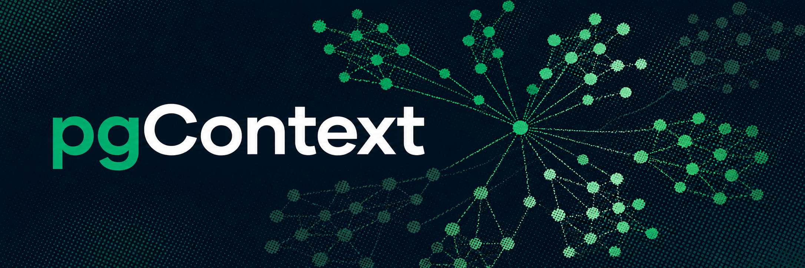
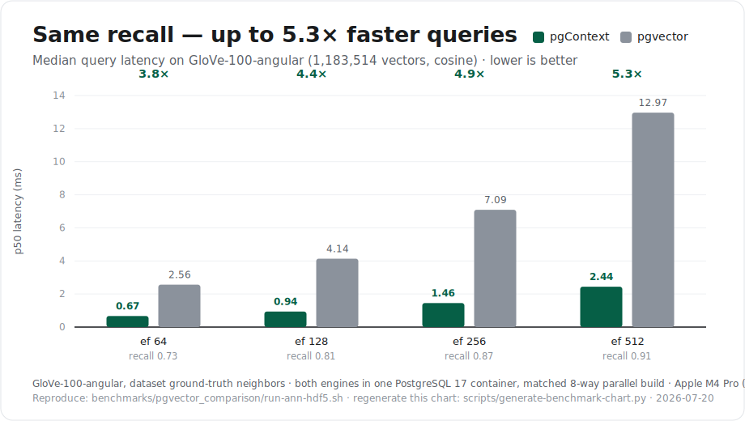
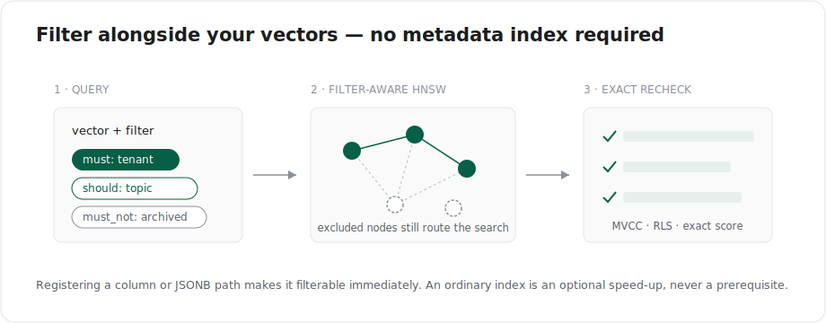

<p align="center">
  
</p>

<h1 align="center">pgContext    <a href="docs/index.md">
    
  </a></h1>

<p align="center">
  <strong>A full AI search engine, built into Postgres.</strong>
</p>

<p align="center">
  Hybrid dense + full-text retrieval, filter-aware ANN, and exact, MVCC-visible
  re-scoring: a dedicated vector engine's feature set, as a PostgreSQL&nbsp;17 extension.
</p>

<p align="center">
  Built by <a href="https://evokoa.com">Evokoa</a>
  &nbsp;·&nbsp;
  Fully-managed hosting at <a href="https://polygres.com">Polygres</a>
</p>

<p align="center">
  <a href="https://github.com/evokoa/pgcontext/stargazers">
    
  </a>
  <a href="https://github.com/evokoa/pgcontext/releases/tag/v0.1.0">
    
  </a>
  <a href="LICENSE">
    
  </a>
  <a href="https://www.postgresql.org/">
    
  </a>
  <a href="https://github.com/evokoa/pgcontext/pkgs/container/pgcontext">
    
  </a>
</p>

<p align="center">
  <a href="https://evokoa.com" target="_blank" rel="noreferrer">
  
  </a>
  <a href="https://x.com/polygres" target="_blank" rel="noreferrer">
    
  </a>
  <a href="https://discord.gg/GnHR8ezuwG" target="_blank" rel="noreferrer">
    
  </a>
  <a href="https://www.producthunt.com/@evokoa" target="_blank" rel="noreferrer">
    
  </a>
</p>

pgContext is an Apache-2.0 **PostgreSQL 17 and 18 extension** that turns Postgres into a
full AI search engine: dense vector search, metadata-filtered approximate search,
and hybrid (dense + full-text) retrieval, all inside the database you already run.

Most retrieval stacks add a second service, copy your application data into it,
and create a separate authorization, backup, and recovery boundary to keep in
sync. pgContext keeps retrieval next to the data it searches: your ordinary
PostgreSQL tables stay the source of truth for vectors, metadata, MVCC, ACL/RLS,
backup, and replication. HNSW and other acceleration state are derived,
rebuildable indexes (never a second copy that can drift), and every approximate
result is re-scored exactly against the live row before it is returned, so a fast
answer is still a correct, permission-safe answer.

**At a glance:** exact and persisted HNSW search · L2, inner-product, cosine, and
L1 metrics · filters over registered columns and JSONB paths · MVCC/ACL/RLS and
exact-score rechecks · collections, scroll, count, facets, and grouping · dense +
full-text hybrid retrieval with reciprocal-rank fusion.

> [!TIP]
> **Looking for a managed version?** We have launched a managed version of pgContext on [polygres.com](https://polygres.com) for full high performance AI Retrieval on Postgres.

## Live demos

See pgContext's retrieval in action (hosted on [Polygres](https://polygres.com)):

- **[Wikipedia hybrid search](https://polygres.com/wikipedia)**: query a Wikipedia-scale dataset with live semantic + keyword hybrid retrieval.
- **[Memory demo](https://polygres.com/user-demo)**: an interactive hybrid-retrieval playground with adjustable fusion weights across retrieval channels.

## Vector search

<p align="center">
  <a href="docs/benchmarks/reports/pgcontext-vs-pgvector.html">
    
  </a>
</p>

<p align="center">
  <sub>Standard <strong>GloVe-100-angular</strong> benchmark (1.18M vectors, cosine),
  both engines in one PostgreSQL&nbsp;17 container with the same parallel build
  budget, scored against the dataset's own ground-truth neighbors.
  <a href="docs/benchmarks/reports/pgcontext-vs-pgvector.html">Full report&nbsp;&rarr;</a></sub>
</p>

pgContext serves persisted, page-native HNSW straight from durable PostgreSQL
index pages. An HNSW plan never substitutes fixture candidates or silently
exact-scans the whole collection. On the standard **GloVe-100-angular** benchmark
(1,183,514 vectors, cosine), with pgContext and pgvector in the same PostgreSQL 17
container and built with the same parallel budget:

- **Faster at the same recall.** pgContext matches pgvector's recall at every
  search setting while answering each query **3.8-5.3× faster** (for example,
  0.910 recall@10 at **2.4 ms** versus **13.0 ms** at `ef_search` 512), and the
  advantage widens as you raise the recall target.
- **Higher recall for the same latency.** Read the other way, that speed is
  quality: given roughly **2.5 ms** per query, pgContext reaches **0.91**
  recall@10 where pgvector reaches **0.75**, because it can afford far more search
  effort in the same time.
- **Every answer is re-checked exactly.** ANN candidates are resolved back to the
  live row and re-scored exactly, under PostgreSQL MVCC visibility, ACL/RLS, and
  SQL predicates: a fast answer is still a correct, permission-safe answer.
- **Hybrid retrieval is built in.** Dense vector search fused with PostgreSQL
  full-text ranking (reciprocal-rank fusion) ships in the extension, not as
  application glue.

All figures above are Apple M4 Pro (NEON). See the
[pgContext vs pgvector report](docs/benchmarks/reports/pgcontext-vs-pgvector.html)
for the full latency and recall curves, the
[three-system comparison](docs/benchmarks/reports/pgcontext-vs-pgvector-vs-qdrant.html)
that adds Qdrant (a strong, mature peer that leads at very high recall through
per-query segment parallelism), and [docs/benchmarks/pgvector.md](docs/benchmarks/pgvector.md)
for every lane.

## Metadata filtering

<p align="center">
  
</p>

Filtering is where vector search usually breaks: bolt a `WHERE` clause onto an
approximate search and recall quietly collapses as the filter gets selective.
pgContext treats filtering as part of the search, not an afterthought.

Write Qdrant-style filters over your registered PostgreSQL columns **and** JSONB
paths: `must` / `should` / `must_not`, equality, `any` / `except`, numeric and
datetime ranges, `is_null` / `is_empty`:

```sql
SELECT source_key, score
FROM pgcontext.search(
    'docs', '[ ... ]'::pgcontext.vector,
    '{
       "must":     [{"key": "tenant_id", "match": "acme"},
                    {"key": "price", "range": {"gte": 10, "lt": 20}}],
       "should":   [{"key": "metadata.topic", "match": {"value": "billing"}}],
       "must_not": [{"key": "archived", "match": true}]
     }'::jsonb,
    10
);
```

What sets it apart:

- **No filter index to build or maintain.** Registering a column or JSONB path
  makes it filterable immediately; pgContext plans and runs the filtered search
  for you, no extra index required. Add an ordinary index (say, a btree on the
  column) later only when you want to speed a specific filter up; it's an
  optimization, not a prerequisite.
- **Filter-aware ANN, not post-filtering.** Below a selectivity crossover
  pgContext scores exactly; above it, it pushes a single reusable mask through
  the persisted HNSW graph while excluded nodes still act as connectors, so
  recall holds up even when the filter is highly selective.
- **One grammar for search, count, and facets.** The same filter drives
  filtered search, counts, and facet aggregation: a cohesive retrieval API,
  not hand-assembled SQL per query.
- **Safe and governed by PostgreSQL.** Filters compile to a typed AST with
  bound parameters over registered fields only (no SQL injection, no mutating
  unregistered columns), and every result is re-checked against MVCC visibility
  and RLS/ACL before it is returned.

See [Filters](docs/user_guide/filters.md) for the full grammar and field
semantics.

## Roadmap

pgContext 0.2.0 extends the V1 foundation with the first complete advanced
retrieval pipeline. It now includes:

- **Broader vector indexing.** First-class non-dense HNSW opclasses, named
  sparse ANN, and scalar/product/binary quantized traversal with exact rerank.
- **Composable retrieval.** Typed dense, filtered, sparse, full-text,
  quantized, recommendation, lookup, and late-interaction branches with
  weighted or reciprocal-rank fusion.
- **Owned serving infrastructure.** Internally maintained late-interaction
  tokens, immutable mapped HNSW generations, and automatic bounded execution
  telemetry.
- **pgvector migration.** A certified PostgreSQL 17 bridge, preflight and
  adoption tooling, and lossless resumable conversion for the supported
  profile without requiring a new application vector column.
- **Graph-augmented retrieval.** We plan to bring graph capabilities from our
  sister extension **[pgGraph](https://github.com/evokoa/pggraph)** into
  pgContext, so vector results can expand and re-rank along the relationships in
  your data (the pattern behind GraphRAG), without leaving Postgres or copying
  data between systems.

The remaining work includes IVFFlat, measured x86 performance claims, broader
PostgreSQL-major certification, and full unqualified pgvector-name
compatibility. See the [known limitations](docs/user_guide/limitations.md),
[product roadmap](docs/user_guide/roadmap.md), and full [roadmap](docs/roadmap.md).

## Quickstart

Like pgvector, pgContext is one `CREATE EXTENSION` away once PostgreSQL can see
it:

```sql
CREATE EXTENSION pgcontext;
```

Pick whichever install path fits your setup: **Docker** (zero build) or
**PGXN / source**. The fastest is the pre-built Docker
image; it is multi-arch (`linux/amd64` and `linux/arm64`) and runs on Linux or
through Docker Desktop's Linux-container support on macOS and Windows.
Choose the matching `pgMAJOR-vVERSION` tag; unqualified version tags continue
to select PostgreSQL 17.

```sh
docker pull ghcr.io/evokoa/pgcontext:pg17-v0.2.0
docker run -d --rm \
  --name pgcontext \
  -e POSTGRES_PASSWORD=postgres \
  -e POSTGRES_DB=pgcontext \
  -p 5432:5432 \
  ghcr.io/evokoa/pgcontext:pg17-v0.2.0
```

Wait for PostgreSQL to accept connections, then verify the extension is loaded
(this uses `psql` inside the container, so you do not need a local PostgreSQL
client):

```sh
until docker exec pgcontext pg_isready -U postgres -d pgcontext; do sleep 1; done
docker exec pgcontext psql -U postgres -d pgcontext \
  -c "SELECT extname, extversion FROM pg_extension WHERE extname = 'pgcontext';"
```

If you have `psql` installed locally you can also connect directly:

```sh
psql -h localhost -U postgres -d pgcontext
```

## Build from Source

For a checkout or downloaded archive:

```sh
make install PG_CONFIG=/path/to/postgresql-17/bin/pg_config
psql -d postgres -c 'CREATE EXTENSION pgcontext;'
```

You need Rust 1.96.0, `cargo-pgrx` 0.19.1, PostgreSQL 17 or 18, its server development
headers, and a matching `pg_config`. See the complete
[installation guide](docs/user_guide/installation.md) for Linux/macOS/Windows
shell support, verification, uninstall, cleanup, and troubleshooting.

## Package Registries

pgContext 0.1.0 is available from
[PGXN](https://pgxn.org/dist/pgcontext/0.1.0/). With PostgreSQL 17,
its server development headers, Rust 1.96.0, and `cargo-pgrx` 0.19.1 installed:

```sh
pgxn install pgContext
```

Homebrew packaging for macOS is still in progress. Until it is published, use
the Docker image, PGXN, or a source build rather than `brew install pgcontext`.

## Installing with an AI Agent

If you are an AI coding agent (or driving one) setting pgContext up in a fresh
environment, follow **[AGENTS.md](AGENTS.md)**: it gives a deterministic,
non-interactive install-and-verify recipe (Docker or source), the exact version
pins, a copy-paste smoke test, and a short explanation of what the extension
does so you can wire it into an application correctly.

## Minimal Packaged Example

```sql
CREATE EXTENSION pgcontext;

CREATE TABLE docs (
    id text PRIMARY KEY,
    embedding pgcontext.vector(3) NOT NULL,
    category text NOT NULL,
    metadata jsonb NOT NULL
);

INSERT INTO docs VALUES
    ('postgres', '[1,0,0]', 'database', '{"language":"sql"}'),
    ('rust', '[0.8,0.2,0]', 'systems', '{"language":"rust"}'),
    ('vectors', '[0.7,0.1,0.2]', 'database', '{"language":"sql"}');

SELECT * FROM pgcontext.create_collection('docs', 'public.docs');
SELECT pgcontext.register_vector('docs', 'embedding', 'embedding', 3, 'cosine');
SELECT pgcontext.register_filter_column('docs', 'category', 'category');
SELECT pgcontext.upsert_points('docs', ARRAY['postgres', 'rust', 'vectors']);

SELECT source_key, score
FROM pgcontext.search(
    'docs', '[1,0,0]'::pgcontext.vector,
    '{"must":[{"key":"category","match":"database"}]}'::jsonb,
    3
);

CREATE INDEX docs_embedding_hnsw
ON docs USING pgcontext_hnsw (
    embedding pgcontext.vector_hnsw_cosine_ops
);

SELECT id, embedding OPERATOR(pgcontext.<=>) '[1,0,0]'::pgcontext.vector AS distance
FROM docs
ORDER BY embedding OPERATOR(pgcontext.<=>) '[1,0,0]'::pgcontext.vector
LIMIT 3;
```

The runnable, output-checked form is [playground/demo.sql](playground/demo.sql).

## How It Works

pgContext registers application-owned tables and filterable fields in extension
catalogs. Exact search is the correctness oracle. The `pgcontext_hnsw` access
method stores metric-bound graph records on PostgreSQL index pages and returns a
bounded candidate set. Every candidate is resolved back to the live source row,
checked against PostgreSQL visibility and filters, and scored exactly before it
is returned. Acceleration state is rebuildable; application data never moves
out of PostgreSQL.

## Feature Status

| Capability | V1 status |
|---|---|
| Dense vectors, exact metrics, casts, and aggregates | Stable |
| Registered-table exact search and metadata filtering | Stable |
| Collections, scroll, count, facets, and grouping | Stable |
| Dense plus PostgreSQL full-text hybrid retrieval | Stable |
| Dense L2, inner-product, cosine, and L1 HNSW | Implemented; performance-qualified on PostgreSQL 17 |
| Metadata-filtered ANN | Implemented with iterative and adaptive masked paths |
| `halfvec`, `sparsevec`, and `bitvec` wrappers/opclasses | Partial, experimental |
| PostgreSQL 17 and 18 | Supported; release images build and verify on amd64 and arm64 |

## Comparison and Fit

| | pgContext V1 | pgvector | Separate vector service |
|---|---|---|---|
| Authoritative data | Ordinary PostgreSQL tables | PostgreSQL columns | Usually copied externally |
| Exact dense search | Yes | Yes | Usually |
| HNSW | Dense, page-native | Mature | Common |
| IVFFlat | Not implemented | Yes | Product-dependent |
| Metadata filtering | Registered PostgreSQL fields/JSONB | SQL predicates | Product-specific filters |
| Drop-in pgvector compatibility | No | Native | No |

For a detailed capability-by-capability view, including where pgvector or Qdrant
is the better fit, see [pgvector migration](docs/user_guide/pgvector_migration.md),
the [parity matrix](docs/user_guide/parity_matrix.md), and the full
[three-way comparison](docs/pgcontext-vs-pgvector-vs-qdrant.md).

## Focused V1 Scope

V1 builds and verifies PostgreSQL 17 and 18 release images on amd64 and arm64, with exact retrieval,
page-native dense HNSW, filtered ANN, and backend-local packed generations.
Additional vector types are available for evaluation and controlled rollout.
The roadmap grows that foundation with deeper lifecycle certification, quantized
navigation, broader non-dense ANN, and more packaging options. See
[Known Issues](docs/known_issues.md) and the [roadmap](docs/roadmap.md) for
precise adoption guidance.

## Documentation

- **[Overview](docs/index.md)**
- **[Quickstart](docs/quickstart.md)**
- **[Installation](docs/user_guide/installation.md)**
- **[Playground](docs/user_guide/playground.md)**
- **[Indexes](docs/user_guide/indexes.md)**
- **[Filters](docs/user_guide/filters.md)**
- **[Operations](docs/user_guide/operations.md)**
- **[SQL API](docs/user_guide/api_reference.md)**
- **[Known issues](docs/known_issues.md)**
- **[Roadmap](docs/roadmap.md)**

## PostgreSQL Authority, Community, and Security

PostgreSQL owns durability, transactions, visibility, roles, RLS, backups, and
replication. Treat pgContext HNSW and other acceleration artifacts as
rebuildable indexes, not an independent database.

Contributions and independent workload testing are welcome. Read
[CONTRIBUTING.md](CONTRIBUTING.md) and the
[Code of Conduct](CODE_OF_CONDUCT.md). Use GitHub issues for public bugs and
support questions. Do not disclose vulnerabilities publicly; follow
[SECURITY.md](SECURITY.md) or email
[team@evokoa.com](mailto:team@evokoa.com).

pgContext is built by [Evokoa](https://evokoa.com), the team behind
[pgGraph](https://github.com/evokoa/pggraph).

## License

Apache-2.0. See [LICENSE](LICENSE) and [NOTICE](NOTICE).
